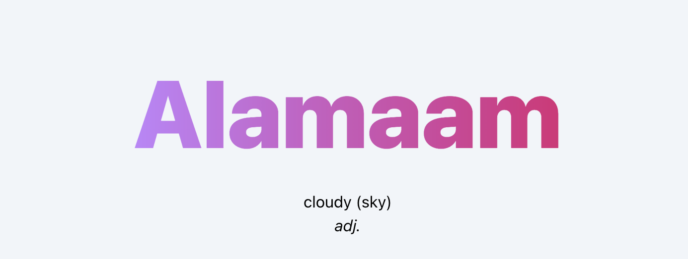

<h1 align="center">Salitag</h1>

<p align="center">
  
</p>

Salitag is a little side project I made to help me and encourage me to learn more about the Tagalog language.

The website name comes from the Filipino word "Salita" which means "Speak/Word" and from the word "Tagalog" which is the most talked language in the Philippines.

To create this Website I worked with SvelteKit, also, because I needed to fill my database with differents words, I used Puppeteer.

## Roadmap

- [ ] Fix null description in the scrapper.ts

- [ ] Make the scrapper more flexible

- [ ] Improve the app UI

- [x] Generate the Open Graph dynamically with Satori

- [ ] Dynamically change provider and url of the prisma.schema

- [ ] If the word of the day is a verb, get it's conjugation data

## Run Locally

Clone the project

```bash
  git clone https://github.com/Kayoshi-dev/salitag
```

Go to the project directory

```bash
  cd salitag
```

Install dependencies

```bash
  npm i
```

Start the server

```bash
  npm run dev
```

Start the scrapper

```bash
  curl -XGET 'http://localhost:5173/api'
```

## Environment Variables

To run this project, you will need to add the following environment variables to your .env file

`WEBSITE`

`DATABASE_URL`
